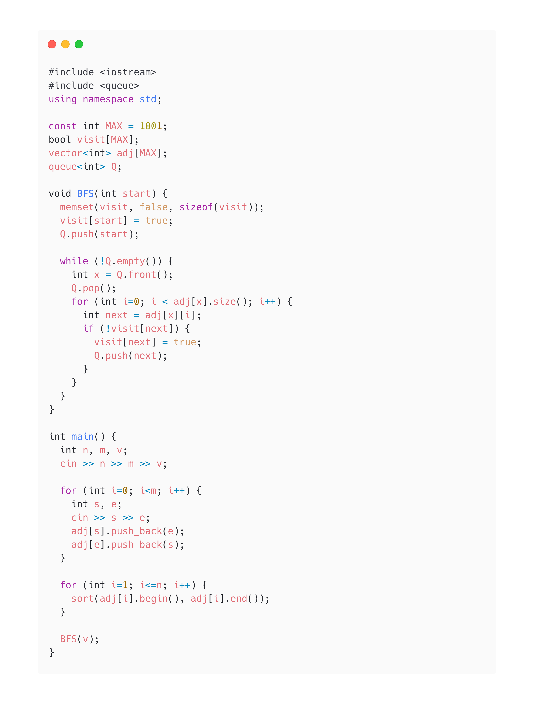

알고리즘을 처음 시작할 때, 이것 저것 찾아보다가 `python이나 c++ STL`을 쓰세요. 라는 글을 꽤 봤었습니다. python으로 할 줄 아는건 for문정도..? 여서 C++을 과감하게 선택했습니다. 문제를 좀 풀어보면서 가장 많이 나오는 `BFS/DFS`에 대해 작성해보았습니다.

## STL이란?
- 표준 C++ 라이브러리 (Standard Template Library)
- 프로그램에 필요한 자료구조, 알고리즘을 Template으로 제공
- 일단 익숙해져보세요!

## 인접 행렬
인접 행렬이란 그래프의 연결 관계를 `이차원배열`로 표현합니다. 보통 adj[][]형태로 많이 작성합니다.

**<center> adj[i][j]: i에서 j로 가는 간선이 있다면 1, 없다면 0 </center>**


위의 그래프를 행렬로 표현하면 다음과 같습니다. 그렇다면, 무방향 그래프라면 어떻게 될까요?


무방향 그래프는 대각 성분을 기준으로 대칭인 성질을 가지게 됩니다.

### 인접 행렬을 왜 사용할까요?
**[장점]**
- 구현이 빠름
- 노드가 서로 연결되어있는지 확인하기 쉬워요. `adj[i][j] = 1`이면 노드 i와 노드 j는 연결되어있어요. 시간복잡도 O(1)

**[단점]**
- 전체 노드 개수: **V** 간선의 개수: **E**
- 특정 노드에 연결된 모든 노드를 검색할 때, `adj[i][1] ~ adj[i][V]`를 전부 확인해야해요. 시간복잡도 O(V)
- 전체 노드 탐색 시 시간복잡도 O(V*V)

### Example
**[무방향 그래프]**
- 노드 개수: n
- 간선 개수: m
  ```C++
  #include <iostream>
  using namespace std;

  int n, m;
  int adj[10][10];
  int main() {
      cin >> n >> m;
      for (int i=0; i<m; i++) {
        int a, b;
        cin >> a >> b;
        adj[a][b] = 1;
        adj[b][a] = 1;
      }
  }
  ```
<br>

## 인접 리스트
인접 리스트란 그래프의 연결 관계를 `vector의 배열`로 표현합니다. 여기서 STL vector가 사용됩니다. 

**<center>adj[i]: i번째 노드에 연결된 노드들을 원소로 갖는 vector</center>**


위의 그래프를 표현하면 다음과 같습니다. 무방향 그래프는 어떻게 될지 감이 오시죠?

### 인접 리스트를 왜 사용할까요?
**[장점]**
- 실제 연결된 노드만 저장
- 모든 vector의 원소의 개수 합 = 간선의 개수
- 전체 노드 탐색 시 시간복잡도 O(E)

**[단점]**
- 노드가 서로 연결되어있는지 확인하는데 오래 걸려요. `인접 행렬`은 adj[i][j]의 값이 1인지 확인하면 연결된 것을 알지만 `인접 리스트`의 경우는 adj[i]가 j를 원소로 갖는지 확인해봐야 해요. 시간복잡도 O(V)

### Example
**[무방향 그래프]**
- 노드 개수: n
- 간선 개수: m
  ```C++
  #include <iostream>
  using namespace std;

  int n, m;
  vector<int> adj[10];
  int main() {
      cin >> n >> m;
      for (int i=0; i<n; i++) {
        int a, b;
        cin >> a >> b;
        adj[a].push_back(b);
        adj[b].push_back(a);
      }
  }
  ```
<br>

## BFS
Breath First Search, 너비 우선 탐색입니다. 인접한 노드를 차례대로 방문하는 특징을 가지고 있습니다. 이때, STL의 Queue를 사용하면 쉽게 구현할 수 있어요.

1. Queue의 가장 앞 노드 **pop**
2. 현재 노드에 인접한 모든 노드중 방문하지 않은 노드 **push**
3. Queue가 비어있지 않다면 1번부터 다시 실행

이때, 각 노드를 방문했는지 저장해주는 `bool` type 배열로 선언해줍니다.

### Example
- 노드 개수: n
- 간선 개수: m
- 처음 시작 노드의 index: v


1. 주어진 문제의 그래프를 `인접 리스트`로 먼저 구현해보세요. (위 사진에서 `sort`를 해준 이유는 문제 요구사항이 인접 리스트의 원소들을 차례대로 방문하기를 원했기 때문이었고, 원래는 sort할 필요는 없습니다.)
2. BFS를 구현해봅시다.
   1. 먼저, 각 노드를 방문했는지 체크하는 `visit` 배열을 초기화해주세요.
   2. BFS()의 입력으로 받은 `start` 노드를 방문했으니 `true`로 입력
   4. Queue에 `start` 노드 **push**
3. Queue가 비어있지 않다면!
   1. Queue의 가장 앞에 있는 값을 **pop**
   2. 인접리스트의 원소 index를 `next`에 저장
   3. 인접한 노드중에서 방문하지 않았다면, `true`로 바꿔주고 Queue에 **push**
   4. adj[]의 크기만큼 반복해줍니다.
   5. 위를 계속 반복

## DFS 
Depth First Search, 깊이 우선 탐색입니다. 시작점에서 노드를 따라 끝까지 간 후, leaf node를 만나게 되면 다시 제자리로 돌아와서 탐색을 하게됩니다. 이때, 재귀함수를 사용하면 쉽게 구현할 수 있어요.

1. 현재 노드의 방문 여부를 `true`로 저장
2. 현재 노드에 연결된 다음 노드를 `next`에 저장
3. 만약 방문했다면 그 다음 노드로 넘어갑니다.
4. 방문하지 않았다면 DFS()를 다시 실행합니다.

### Example
- 노드 개수: n
- 간선 개수: m
- 처음 시작 노드의 index: v


위의 BFS 예제와 인접 리스트 구현 과정은 동일해요. DFS()만 봐주시면 됩니다.

1. DFS()의 입력으로 받은 `cur`를 방문했으니 `true`로 입력
2. 인접리스트의 원소 index를 `next`에 저장
3. 방문했다면 반복문을 계속 진행한다.
4. 방문하지 않았다면 DFS() 재귀를 통해 1번부터 반복한다.

BFS/DFS에 익숙해지려면 문제를 많이 푸는 방법뿐인 것 같아요. 백준에 BFS, DFS로 분류된 문제들을 많이 풀어보세요. 🙂 (자기 자신에게 하는 말) <br>
가장 처음 풀어보기 좋은 문제는 [백준 1260번](https://www.acmicpc.net/problem/1260)인 것 같아요. 
[1260번 풀이 보러가기](https://github.com/seohyun0120/algorithm-study/blob/master/BOJ/1260.cpp)

혹시 틀린 부분이 있거나 추가적인 설명이 필요한 부분이 있다면 댓글 부탁드려요. 언제나 환영입니다. 누군가에겐 되셨길 바라며...🙏