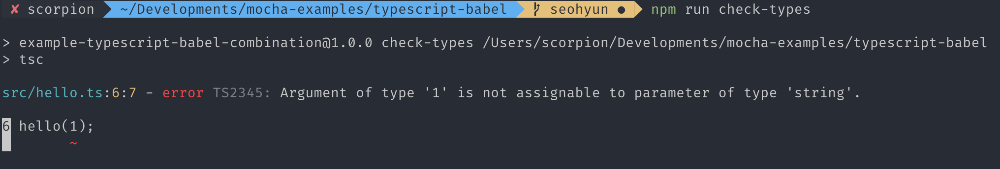
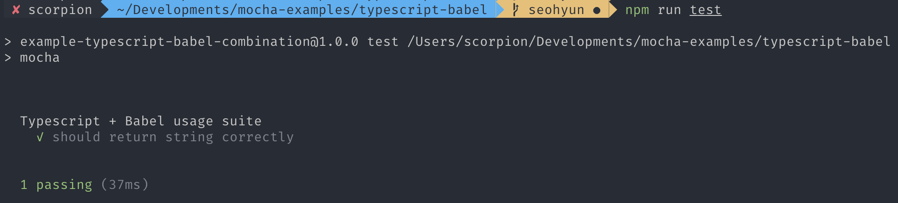

[Mocha Example](https://github.com/mochajs/mocha-examples)에 `TypeScript + Babel + Mocha`가 있었으면 좋겠다는 의견을 보고, 예제를 작성하기 시작했다. Mocha 사용법보다는 사용하기 위한 **개발 환경 세팅**에 초점이 맞춰진 글이다.

# TypeScript + Babel = Why?

TypeScript는 `tsc`가 js로 컴파일을 해주는데 굳이 Babel까지 쓰면서 개발해야할까? 와 같은 고민을 할 수 있다. 하지만 **Babel7**에 `@babel/preset-typescript`가 등장하며 이와 같은 고민을 날려주었다.

여기서 잠깐, TypeScript는 뭐고 Babel은 또 뭐지? 하는 사람을 위해...

- ## TypeScript
  TypeScript는 JavaScript를 확장한 언어로, JS의 특성을 침범하지 않고 최신 ECMA 표준을 지원한다. **JavaScript의 타입을 체크**해주는 아주 멋진 아이이다. (한번 TS의 편리함을 알게되면 JS가 불편해질 것이다. 적어도 나는 그랬다.)

- ## Babel
  Babel은 **JavaScript 컴파일러**이다. ES6+의 코드를 ES5 이하의 버전으로 변환해주는 도구이다. ES6+를 사용하려면 IE를 포함해서 모든 브라우저에 문제없이 작동하도록 개발 환경을 맞춰줘야한다. Babel은 필수이다! (아직 쓰지않고있다면 당장 도입해보는 것을 추천한다. [Babel](https://babeljs.io/))

- ## tsc 대신에 Babel?
  위에도 말했듯이 `tsc`가 `.ts`를 `.js`로 컴파일 해주는데 왜 Babel을 써야할까?우리는 TypeScript는 그저 **type checking** 용도로 사용할 것이다. TypeScript로 작성된 모든 파일을 컴파일하고, 문제가 없다면, Babel을 활용해 JavaScript로 transpile 해주면 된다.

  * TypeScript: Check Types
  * Babel: Transpile TS into JS

<br>

# TypeScript + Babel + Mocha️

이제 기본적인 환경에 대한 이해를 했으니 직접 만들어보자

- [전체적인 파일 구조](#전체적인-파일-구조)
- [devDependencies](#devdependencies)
- [TS 설정](#ts-설정하기)
- [Babel 설정](#babel-설정하기)
- [Mocha 설정](#mocha-설정하기)
- [scripts 작성하기](#scripts-작성하기)
- [테스트 코드 작성하기](#테스트-코드-작성하기)

## 전체적인 파일 구조
- ```
  typescript-babel
  |__ src
      |__ ...
  |__ test
      |__ ...
  |__ tslint.json
  |__ tsconfig.json
  |__ babel.config.js
  |__ .mocharc.json
  |__ package.json
  |__ package-lock.json
  ```

<br>

## devDependencies

필요한 dependencies를 설치해보자.

### Babel

- ```json
  "devDependenceis": {
      "@babel/cli": "^7.2.3",
      "@babel/core": "^7.4.0",
      "@babel/register": "^7.6.2",
      "@babel/preset-env": "^7.4.1",
      "@babel/preset-typescript": "^7.3.3",
  }
  ```

| packages | 기능 |
|---|:---:|
| `@babel/cli` | command line을 활용해 코드를 transplie 해준다 |
| `@babel/core` | babel의 기본적인 기능들이 들어있다 |
| `@babel/register` | 각각의 module을 결합해주는 hook module |
| `@babel/preset-env` | 최신 JS 기능을 ES5로 transpile 해준다 |
| `@babel/preset-typescript` | TypeScript를 지원해준다 |

### TypeScript

- ```json
  "devDependenceis": {
      "tslint": "^5.14.0",
      "typescript": "^3.3.3"
  }
  ```

| packages | 기능 |
|---|:---:|
| `tslint` | TS 코드를 분석해주는 도구이다 |
| `typescript` | JS 확장 언어 |

### Mocha

- ```json
  "devDependenceis": {
      "@types/mocha": "^5.2.7",
      "assert": "^1.4.1",
      "mocha": "^6.2.1",
  }
  ```

| packages | 기능 |
|---|:---:|
| `@types/mocha` | mocha type definition이 포함되어있다 TS를 써야하니 types는 필수! |
| `assert` | NodeJS에서 제공하는 assert 라이브러리 |

<br>

## TS 설정하기

우리는 TypeScript를 **type-checking**용으로 사용된다. `lint`와 `tsc` 설정을 해보자.

### scripts

#### package.json

- ```json
  "scripts": {
      "check-types": "tsc",
      "lint": "tslint --project tsconfig.json",
  }
  ```

#### tsconfig.json

여기서는 컴파일 옵션과 컴파일 대상에 대한 설정을 할 수 있다. `"noEmit : true` 옵션을 통해서 컴파일 결과를 저장하지 않도록 설정한다. only type-check!

- ```json
  {
      "compilerOptions": {
        "outDir": "./lib",
        "rootDir": "../",
        "noEmit": true
      },
      "include": ["src/**/*", "test/index.spec.ts"],
      "exclude": ["node_modules"]
  }
  ```

#### tslint.json

여기에선 lint 규칙을 설정할 수 있다. TSLint가 공식적으로 제공하는 패키지로, 기본적으로 추천하는 설정들을 모아놓은 패키지이다. 혹은 직접 설정해도 무방하다.
- ```json
  {
    "extends": "tslint:recommended"
  }
  ```

<br>

## Babel 설정하기

Babel 설정을 해보자. 위에서 사용되는 package들은 전부 작성했으니 이제 사용해볼 일만 남았다.

#### babel.config.js

- ```javascript
  module.exports = (api) => {
      // Cache configuration is a required option
      api.cache(false);

      const presets = [
        "@babel/preset-typescript",
        "@babel/preset-env"
      ];

      return { presets };
  };
  ```

`api.cache(false)`: Babel은 파일이 컴파일 될때마다 config function이 다시 실행되는 것을 막아준다. 하지만 해당 설정을 통해 cache 옵션을 없애주자. `preset`들을 작성해주고, 추가적으로 `plugin`을 설치할 경우 아래와 같이 추가해주면 된다.

- ```javascript
  const plugins = [
      ...
  ];

  return { presets, plugins};
  ```

<br>

## Mocha 설정하기

가장 중요한 Mocha 설정만 남았다. mocha의 설정은 `.mocharc.json` 파일에 작성하면 되는데, `.json`이 아니어도 `.js`, `.yaml`도 지원한다. 자세한건 [Mocha 공식 문서](https://mochajs.org/#configuring-mocha-nodejs)를 확인해보자.

**.mocharc.json**

- ```json
  {
      "extension": ["ts"],
      "spec": "test/**/*.spec.ts",
      "require": "test/babel-register.js"
  }
  ```

본 예제의 테스트 코드는 `test` 폴더 하위에 작성하는 구조로 구성되어있다. 가장 중요한 점은 `require` 옵션이다. [Babel에 올라온 이슈](https://github.com/babel/babel/issues/8962)에 의하면, `--require @babel/register` 옵션만으로는 TS를 테스트할 수 없기에 `babel-register.js` 파일을 추가하여 TypeScript를 추가해줘야한다.

**test/babel-register.js**

- ```javascript
  const register = require('@babel/register').default;

  register({ extensions: ['.ts', '.tsx', '.js', '.jsx'] });
  ```

## scripts 작성하기

모든 설정을 완료했으니 scripts를 작성해보자.

#### package.json

- ```json
  "scripts": {
      "check-types": "tsc",
      "lint": "tslint --project tsconfig.json",
      "compile": "babel src -d lib --extensions '.ts,.tsx'",
      "prepublish": "npm run check-types && npm run compile",
      "test": "mocha"
  },
  ```

각각 명령어에 대한 설명은 테스트코드를 작성하면서 설명해야겠다.

<br>

## 테스트 코드 작성하기

먼저, `string`을 인자로 받아 `Hello ${name}`을 return하는 아주 간단한 함수를 만들어보자.

#### src/hello.ts

- ```typescript
  export default function hello(name: string) {
      return `Hello ${name}`;
  }

  hello("mocha");
  hello(1);
  ```

> **npm run lint** : "tslint --project tsconfig.json"

해당 명령어를 통해 lint 작업을 해보자.

> **npm run check-types** : "tsc"

다음과 같이 작성한 후 `npm run check-types`를 실행해보자.

`string`이 아닌 type이 들어갈 경우, 에러를 띄워주는 것을 확인할 수 있다.

<br>

이제 해당 함수에 대한 테스트 코드를 작성해보자.

#### test/index.spec.ts

- ```typescript
  import { equal } from "assert";
  import { hello } from "../src";

  describe("Typescript + Babel usage suite", () => {
      it("should return string correctly", () => {
          equal(hello("mocha"), "Hello mocha");
      });
  });
  ```

> **npm run compile** : "babel src -d lib --extensions '.ts,.tsx'"

위와 같이 작성한 후, `npm run compile`를 실행해보자. 여기서 `--extensions '.ts,.tsx'` 옵션을 통해 `@babel/cli`가 `.ts`나 `.tsx` 파일을 처리할 수 있도록 해줘야한다.


다음과 같이 `lib` 폴더가 생성되면서 TS를 JS로 변환된 것을 확인할 수 있다.

> **npm run test** : "mocha"

`npm run test`를 실행해보자.

Test에 성공한 것을 확인할 수 있다.

# 마무리

이렇게 TypeScript + Babel을 사용해서 Mocha로 test하는 환경을 구성해보았다. 해당 예제의 전체 소스는 [Mocha Examples / Typescript-Babel](https://github.com/mochajs/mocha-examples/blob/master/typescript-babel/README.md) 여기서 확인할 수 있다. 처음으로 contribute 해봤는데 뿌듯하다 😍 예제 작성하면서 배우고, 이 글을 쓰면서 한 번 더 배울 수 있었던 계기가 된 것 같다!

# Reference

- [TypeScript With Babel: A Beautiful Marriage](https://iamturns.com/typescript-babel/)

- [MicroSoft: TypeScript-Babel-Starter](https://github.com/microsoft/TypeScript-Babel-Starter)

- [Mocha Examples (TypeScript)(Babel)](https://github.com/mochajs/mocha-examples)
