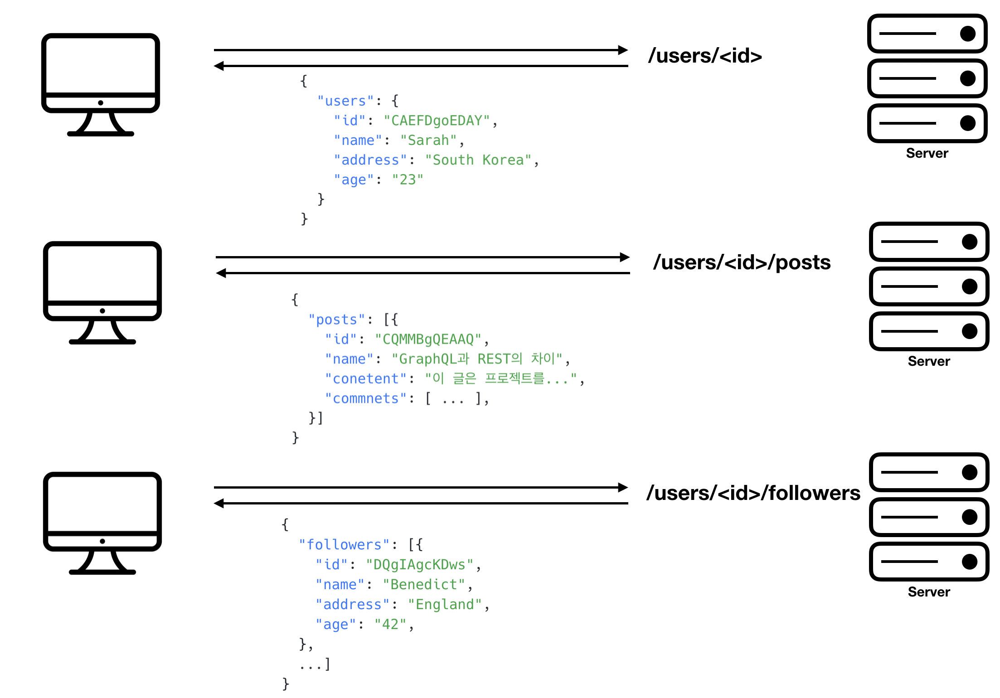
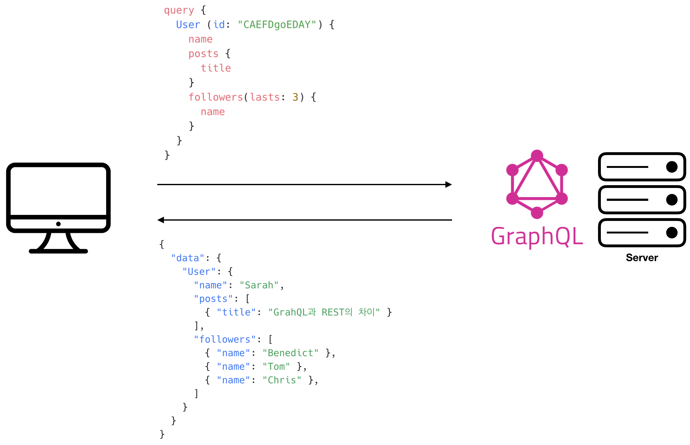

이번 글에서는 내가 이해한 GraphQL의 **개념적인 부분**에 대해 적어보려고 한다. GraphQL은 왜 RESTful보다 더 좋을까? 왜 도입해야할까? 뭐가 다를까? 한번 알아보도록 하자 🧐

 

 

# GraphQL의 핵심은 Query
REST(Representational State Transfer)는 Web API를 설계하는데에 있어 가장 보편적으로 알려진 아키텍처이다. 하지만 REST API는 급변하는 Client들의 요구사항을 따라가기엔 너무나도 유연성이 떨어진다. GraphQL은 이런 단점을 보완해준다.
 

## REST의 핵심
1. URI는 정보의 자원(Resource)을 표현한다.
2. 자원(Resource)에 대한 행위는 HTTP Method (GET, POST, PUT, DELETE)로 표현한다.

`GET /users` , `POST /users` , `DELETE /users/:uid` 와 같이 다중 엔드포인트에 접근하여 필요한 데이터들을 수집해야했다.
 

## GraphQL의 핵심 🔥
하지만 GraphQL은 **단일 엔드포인트**만으로 원하는 데이터를 언제든지 수집할 수 있다. `/graphql` 에 요청을 보내기만 하면 된다. 우리가 서버에 제공할 것은 단 한가지, **Query**이다. Resource를 가져올 Query 혹은 Resource를 변경하기위한 Mutation만 던져주면, 서버는 알아서 Query Language에 맞는 데이터를 JSON형태로 돌려준다.

 

# GraphQL로 데이터를 가져오는 것은 매우 쉽다 
GraphQL에게 필요한 것은 **Query Language** 하나뿐이다. 아래 예제를 통해 살펴보자

> 해당 예제는 [GraphQL is the better REST](https://www.howtographql.com/basics/1-graphql-is-the-better-rest/)에 적힌 예제를 기반으로 작성되었다.

얻고자 하는 정보: user `id`: ‘CAEFDgoEDAY’의 `name`, 작성한 post들의 `title`, 최근 follower들의 `name`
 

## REST
REST를 사용하게 될 경우, 총 세 번의 요청을 보내야한다.

1. 첫 번째로, 해당 user의 데이터를 가져오기위해 `/users/<id>` 엔드포인트에 요청을 보낸다. 
2. 두 번째로, 해당 user가 작성한 모든 post를 가져오기위해 `/users/<id>/posts` 엔드포인트에 요청을 보낸다. 
3. 세 번째 요청은 `/users/<id>/followers` 가 될 것이고 응답으로는 해당 user의 follower 목록이 올 것이다.

 

>REST를 사용하면, 얻고자하는 데이터를 가져오기 위해서는 다른 엔드포인트에 세 번의 요청을 보내야한다. 또한, 필요하지 않은 정보까지 받게 되므로 비효율적이다.

 

## GraphQL 👆
반면에 GraphQL은 위와 같은 여러 번의 요청없이 **`하나의 query`**를 전송하면 된다. GraphQL 서버는 query에 적힌 요구 사항대로 JSON 객체로 응답한다.

 

>GraphQL을 사용하면 Client는 Query에 적힌 필요한 데이터를 정확하게 전달해준다. Query에 정의된 내용에 따라 Server의 응답 구조는 달라진다.

 

훨씬 간단해지지 않았나요? 이게 바로 GraphQL의 장점이다. **`단일 엔드포인트에 원하는 정보를 포함한 하나의 Query문`**, 이것이면 충분하다.
 

# 더이상 Overfetching과 Underfetching은 없다

## Overfetching: 불필요한 정보 다운로드
Overfetching이란 Client가 데이터를 가져올 때, 실제로 필요하지 않은 데이터까지 fetch하는 것을 뜻한다. 위의 예제처럼 Client는 해당 **user**의 `name`만 필요로 하는데 응답으로는 `address`, `age`까지 받는 것이 바로 `overfetching`이다.

 

## Underfetching: 필요한 정보를 얻지 못하는 것
Underfetching이란 Overfetching의 반대 개념으로, 특정 엔드포인트가 필요로하는 정보를 충분히 제공하지 않는 것을 뜻한다. 즉, Client는 해당 요구사항을 충족시키기 위해 추가적인 요청을 해야한다는 것이다. 이때 최악의 경우는 **N+1** 문제이다. 위의 예제처럼 **user**마다 최근에 등록된 **follower** 세 명을 필요로한다고 가정해보자. 먼저, `/users` 엔드포인트에 요청하여 user정보를 얻은 후, `/users/<id>/followers` 를 각 **user**에게 전송해야한다.

 

지금까지 GraphQL에 대한 기본적인 개념에 대해 알아보았다. 하지만 항상 느끼는 점이지만 뭐가 좋고 나쁜지에 대해서는 **직접 써보는게 제일 좋다**고 생각한다. 혹시 GraphQL 도입을 고민중이라면 꼭! 써보길! 내가 사용중인 블로그 플랫폼인 **gatsby**도 GraphQL을 쓰고 있다. GraphQL 다들 도입해보세요 😎

 

*Reference*
1. [GraphQL 공식 문서](https://graphql.org/learn/) - 공식 문서 읽기를 생활화합시다
2. [GraphQL is the better REST](https://www.howtographql.com/basics/1-graphql-is-the-better-rest/) - How to GraphQL
3. [Top 5 Reasons to Use GraphQL](https://www.prisma.io/blog/top-5-reasons-to-use-graphql-b60cfa683511) - Prisma